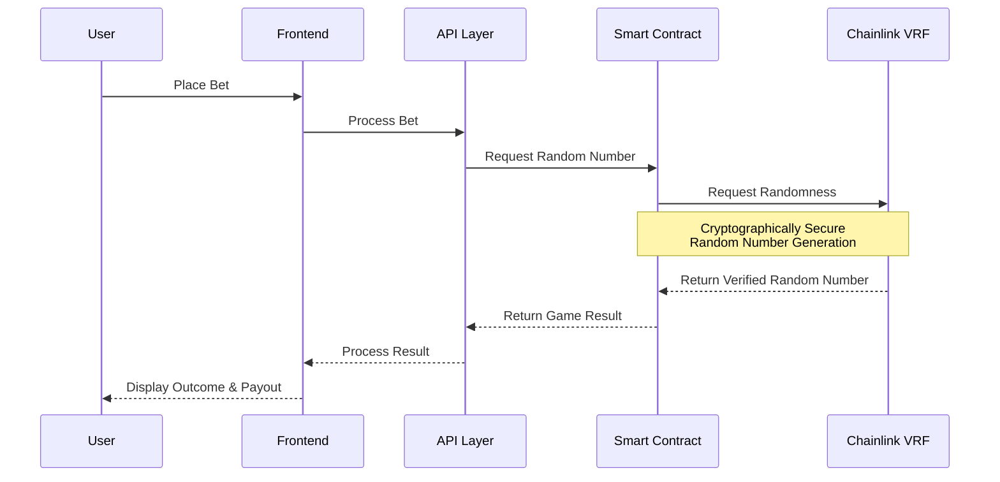
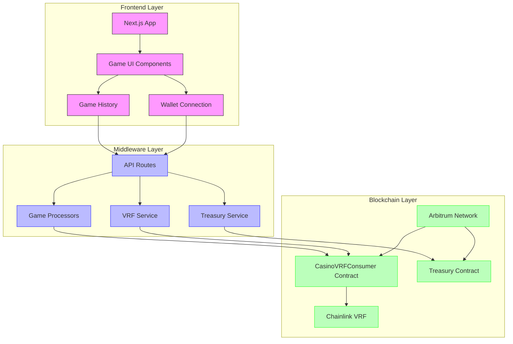
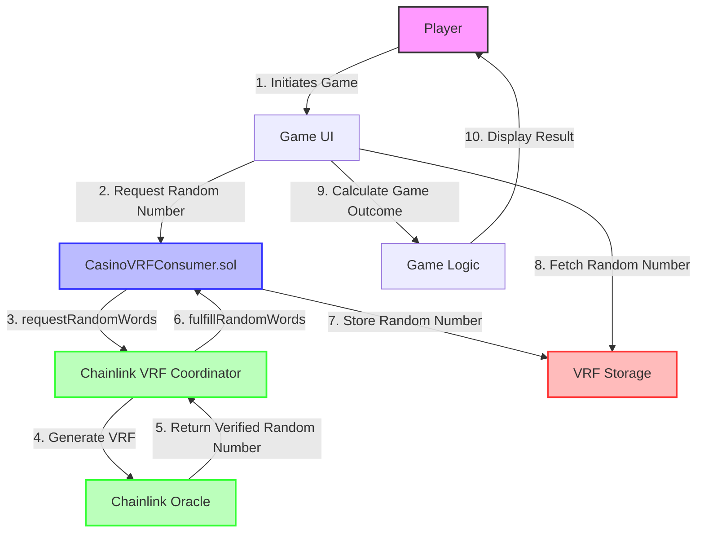
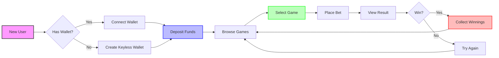

# 🎮 APT-Casino: A hyper-composable, Fully On-Chain, Provably-Fair Casino 

A couple of days back, I was was on etherscan exploring some transactions and saw an advertisement of [https://stake.com/](url) which was giving 200% bonus on first deposit, I deposited 120 USDT into stake.com they gave 360 USDT as total balance in their controlled custodial wallet and when I started playing casino games I was shocked to see that I was only able to play with $1 per game and was unable to increase the betting amount beyond $1 and when I tried to explore and play other games on the platform the issue was persisting, I reached the customer support and got to know that this platform has cheated me under the name of wager limits as I was using the bonus scheme of 200%.

When I asked the customer support for refund they showed a mathematical equation which says if refund then I have to play $12,300 worth of gameplay and this was a big shock for me. Thereby, In the hope of getting the deposited money back, I played the different games of stake.com like roulette, mines, spin wheel, etc, the entire night and lost all the money and time.

I was very annoyed of that's how Apt-Casino was born, gamblefi all in one platform where new web3 users can play games, perform gambling but have a safe, secure, transparent environment that does not scam any of their users. Also, I wanted to address common issues in traditional gambling platforms.

> **Revolutionizing GambleFi with Arbitrum L2 & Chainlink VRF**

<div align="center">
  
  <p><em>Next-Gen Decentralized Casino Powered by Cryptographic Randomness</em></p>
</div>

[](https://arbitrum.io/)
[](https://chain.link/vrf)
[](https://nextjs.org/)
[](https://supabase.com/)
[](https://livepeer.org/)
[](https://vercel.com/)

## 📋 TABLE OF CONTENTS

- [Paradigm Shift](#-paradigm-shift-web3-gambling-reimagined)
- [Core Innovations](#-core-technological-innovations)
- [Game Suite](#-game-suite-cryptographically-secured-entertainment)
- [Live Features](#-live-features-new) ⭐ NEW
- [Technical Architecture](#️-technical-architecture)
- [Development & Deployment](#-development--deployment)
- [Security](#-cryptographic-security-measures)
- [Documentation](#-documentation)
- [Recent Updates](#-recent-updates)
- [Links](#-links)

## 🌟 PARADIGM SHIFT: WEB3 GAMBLING REIMAGINED

APT-Casino isn't just another blockchain gambling platform—it's a **hyper-composable, fully on-chain, provably-fair casino ecosystem** that fundamentally disrupts the traditional gambling industry's opacity. Born from the frustration with predatory Web2 gambling platforms that employ:

- ❌ Rigged outcomes manipulated behind closed doors
- ❌ Hidden wager limits designed to trap user funds
- ❌ Restrictive withdrawal policies with impossible conditions
- ❌ Deceptive "bonus schemes" with unrealistic wagering requirements

**APT-Casino introduces a zero-trust gambling protocol where mathematics replaces faith and cryptographic proofs eliminate uncertainty.**

## 🔥 CORE TECHNOLOGICAL INNOVATIONS

### ⚡ Chainlink VRF-Powered Randomness Engine

Our platform leverages **Chainlink VRF v2.5 on Arbitrum Sepolia** to generate ungameable, entropy-rich randomness with cryptographic guarantees:

```
Confirmation Time Calculation:
• Chainlink VRF → Requires 6 block confirmations
• Arbitrum block time ≈ 0.25s
• Total randomness generation time = 6 × 0.25s = 1.5s
```

This means your roulette wheel resolves in under 2 seconds, with trustless fairness guaranteed by cryptographic proofs anchored to the Ethereum L1. **This is not just RNG. This is L2-synchronized, L1-verified entropy injection.**

### 🌐 Zero-Friction UX Architecture

- **Gasless Meta-Transactions**: Players never touch MetaMask popups; gas is abstracted via a meta-transaction relayer funded by our treasury
- **Keyless Authentication**: Seamless login via Google/Apple OAuth + traditional wallet connections


- **Non-Custodial Asset Management**: Zero custody of user funds—all balances are on-chain escrows

### 🔐 Cryptoeconomic Security Framework

- **L1-Anchored Randomness**: VRF proofs are Ethereum L1-verifiable, removing any chance of manipulation even at validator level
- **Transparent Treasury**: All casino operations funded through a transparent treasury contract at `0xb424d2369F07b925D1218B08e56700AF5928287b`
- **Composable Game Primitives**: Modular contracts for Roulette, Mines, Plinko, Spin Wheel, enabling a casino-as-a-protocol ecosystem

## 🎲 GAME SUITE: CRYPTOGRAPHICALLY SECURED ENTERTAINMENT

### 🎮 Game Logic Sequence



### 🎯 Roulette
- **Supported Bets**: Straight, Split, Street, Corner, Line, Dozen, Column, Red/Black, Odd/Even, High/Low
- **RNG**: VRF-seeded spin
- **Max Payout**: 35:1

### 💣 Mines
- **Grid**: 5×5, up to 24 mines
- **Compounding multipliers** per safe reveal
- **Player can cashout early** at any time

### 🔵 Plinko
- **Balls dropped through VRF-determined paths**
- **Multipliers**: 0.2× → 100× depending on depth and slot

### 🎡 Spin Wheel
- **Configurable risk**: Low (1.2×-2×), Medium (2×-5×), High (5×-20×)
- **Instant outcome** in ~1.5s

## 🛠️ TECHNICAL ARCHITECTURE

<div align="center">
  
</div>


### 🔄 System Architecture Diagram




### 🧠 System Components

```
src/
├── app/                    # Next.js app directory
│   ├── game/              # Game pages
│   │   ├── roulette/      # Roulette game
│   │   ├── mines/         # Mines game
│   │   ├── wheel/         # Wheel game
│   │   └── plinko/        # Plinko game
│   ├── live/              # Live streaming page (NEW!)
│   ├── api/               # API routes
│   │   ├── livepeer/      # Livepeer streaming APIs (NEW!)
│   │   └── youtube/       # YouTube metadata APIs (NEW!)
│   └── providers.js       # App providers
├── components/            # React components
│   ├── LiveChat.js        # Live chat widget (NEW!)
│   └── Navbar.js          # Updated with Live features
├── hooks/                # Custom hooks for blockchain interaction
├── services/             # VRF and game services
├── lib/                  # Utilities and configurations
│   ├── supabaseClient.js  # Supabase configuration (NEW!)
│   └── livepeer.js        # Livepeer client (NEW!)
└── styles/               # Global styles

contracts/
├── CasinoVRFConsumer.sol  # Chainlink VRF consumer contract
```

### 🔄 Randomness Flow



The randomness flow demonstrates how APT-Casino ensures provably fair outcomes:

1. **Request**: Game initiates VRF request through `CasinoVRFConsumer.sol`
2. **Generation**: Chainlink VRF produces cryptographically secure random numbers
3. **Verification**: On-chain verification of VRF proof
4. **Consumption**: Game consumes verified randomness to determine outcome
5. **Transparency**: All steps verifiable on Arbitrum blockchain

## 🚀 DEVELOPMENT & DEPLOYMENT

### Frontend Development
```bash
# Start development server
npm run dev

# Build for production
npm run build

# Start production server
npm start

# Run linting
npm run lint
```

### Contract Development
```bash
# Compile contracts
npx hardhat compile

# Run tests
npx hardhat test

# Deploy to Arbitrum Sepolia
npx hardhat run scripts/deploy-vrf.js --network arbitrum_sepolia
```

### Environment Variables
```env
# Arbitrum Configuration
NEXT_PUBLIC_NETWORK=arbitrum_sepolia|arbitrum_one
NEXT_PUBLIC_VRF_CONTRACT_ADDRESS=your_vrf_contract_address

# Treasury
TREASURY_PRIVATE_KEY=your_treasury_private_key
TREASURY_ADDRESS=0xb424d2369F07b925D1218B08e56700AF5928287b

# Chainlink VRF
VRF_SUBSCRIPTION_ID=your_subscription_id
VRF_COORDINATOR=your_vrf_coordinator_address

# Supabase (Live Chat & Streaming)
NEXT_PUBLIC_SUPABASE_URL=https://your-project.supabase.co
NEXT_PUBLIC_SUPABASE_ANON_KEY=your_anon_key

# Livepeer (Optional - for streaming metrics)
NEXT_PUBLIC_LIVEPEER_API_KEY=your_livepeer_api_key
```

**Note:** Live features are already configured with shared Supabase credentials from Polygon deployment.

## 🔐 CRYPTOGRAPHIC SECURITY MEASURES

### On-Chain Randomness
All games use Chainlink VRF randomness with:
- Cryptographic proof verification
- On-chain fulfillment
- Transparent request-response cycle

### Provably Fair Mechanics
- All game logic is on-chain
- Randomness is cryptographically verifiable
- No server-side manipulation possible
- Full transparency in outcome determination

### Smart Contract Security
- Reentrancy protection
- Input validation
- Proper error handling
- Event logging for transparency
- Treasury fund isolation

## 🎥 LIVE FEATURES (NEW!)

### 💬 Real-Time Live Chat
Transform your casino into a social hub with integrated real-time messaging:

- **🔴 Live Communication**: Real-time messaging powered by Supabase with WebSocket support
- **👤 Wallet Identity**: Shows shortened wallet addresses (0x1234...5678) for privacy
- **💾 Persistent History**: Chat messages stored and synced across all sessions
- **📱 Responsive Widget**: Minimizable floating chat widget (bottom-right corner)
- **🌐 Cross-Chain Sync**: Shared chat across Polygon and Arbitrum deployments
- **👥 Guest Mode**: Non-connected users can chat as "guest"
- **⚡ Real-time Updates**: Instant message delivery with automatic fallback polling

**How to Use:**
1. Click the purple/pink **"Live Chat"** button in the navbar (top-right)
2. Type your message and press Send
3. See messages from all players in real-time

### 📺 Live Casino Streaming
Watch and broadcast live casino gameplay with multi-source streaming support:

- **🎬 Multi-Source Support**:
  - Livepeer (decentralized streaming)
  - YouTube Live (instant integration)
  - HLS streams (any .m3u8 URL)
  
- **📊 Live Metrics**:
  - Real-time viewer count
  - Stream bitrate monitoring
  - Latency tracking
  - Resolution information

- **🎯 Features**:
  - Grid layout for multiple simultaneous streams
  - YouTube metadata (title, channel, thumbnail)
  - Copy stream URLs with one click
  - "How to Stream" guide modal
  - Responsive design (1/2/3 column grid)

- **🔴 Live Indicators**: 
  - Pulsing red dot for active streams
  - Stream source badges (Livepeer/YouTube)
  - Interactive player controls

**How to Stream:**
1. Navigate to `/live` or click "Live" in navbar
2. Choose your source:
   - **Livepeer**: Enter playback ID (e.g., `f5eese9wwl88k4g8`)
   - **YouTube**: Paste any YouTube live URL
   - **HLS**: Paste .m3u8 stream URL
3. Click "Add" and start watching!

**Quick Setup:** See [LIVE_FEATURES_SETUP.md](LIVE_FEATURES_SETUP.md) for complete setup guide including:
- Supabase database configuration
- Environment variables
- Table creation SQL scripts
- Troubleshooting tips

## 🌐 FUTURE ROADMAP: EXPANDING THE GAMBLEFI ECOSYSTEM

1. **Mainnet Launch** (Arbitrum One)
2. **Integration with CCIP** → Cross-chain casino liquidity + bets from Base, Optimism, Polygon
3. **AI-Powered Dealer Bots** → Agents that interact with players
4. **SocialFi Layer** → Enhanced on-chain player interactions
5. **NFT Player Profiles** → "Luck Streaks" minted as on-chain reputation assets

## 📱 CROSS-PLATFORM COMPATIBILITY

The application is fully responsive and optimized for:
- **Desktop**: Chrome, Firefox, Safari, Edge
- **iOS Safari**: Full support with native-like experience
- **Android Chrome**: Full support with optimized UI
- **Hardware wallets**: Ledger, Trezor integration
- **Software wallets**: MetaMask, Rainbow, Trust Wallet, etc.

### 🧭 User Journey Flow



## 📚 DOCUMENTATION

- **[Complete Tech Stack](TECH_STACK.md)** - Full breakdown of all technologies used
- **[Live Features Setup Guide](LIVE_FEATURES_SETUP.md)** - Complete setup for Live Chat & Streaming
- **[Migration Summary](LIVE_FEATURES_MIGRATION.md)** - Details on features ported from Polygon
- **[Quick Start Guide](QUICK_START_LIVE_FEATURES.md)** - Get started with live features in 5 minutes
- **[Architecture Documentation](APT_CASINO_ARCHITECTURE.md)** - System architecture details

## 🆕 RECENT UPDATES

### v2.0 - Live Features Release
- ✅ Added real-time Live Chat widget with Supabase
- ✅ Integrated Live Streaming page (Livepeer, YouTube, HLS)
- ✅ Cross-chain chat & streams (shared with Polygon)
- ✅ Live metrics and YouTube metadata
- ✅ Mobile-responsive chat widget
- ✅ Guest mode for non-connected users

### Key Technologies Added
- **Supabase**: Real-time database for chat & streams
- **Livepeer**: Decentralized video streaming
- **@livepeer/react**: Video player components
- **YouTube oEmbed API**: Live stream metadata

## 🌀 FINAL WORD

APT-Casino on Arbitrum is not just a casino. It's a **decentralized probability engine**, a **financialized entertainment protocol**, and a **GambleFi layer** redefining how risk, randomness, and rewards converge in Web3.

With the addition of Live Chat and Streaming, APT-Casino becomes a **complete social casino platform** where players can:
- 🎰 Play provably fair games
- 💬 Chat with other players in real-time
- 📺 Watch and broadcast live gameplay
- 🌐 Connect across multiple chains

This is not gambling. This is mathematics you can verify, luck you can own, community you can build, and trust you don't need.

## 🔗 LINKS

- **GitHub Repository:** https://github.com/AmaanSayyad/APT-Casino-Arbitrum
- **Pitch Deck:** https://www.figma.com/deck/3TtaQDRChEZ6R2MhaKR94p/APT-Casino-Arbitrum
- **Demo Video:** https://youtu.be/DiMBXt17iuw
- **Pitch Video:** https://youtu.be/SMpQZryXl5U
- **Live Website:** https://apt-casino-arbitrum1.vercel.app/

## 🛠️ TECH STACK

For a complete breakdown of all technologies, frameworks, and libraries used in this project, see **[TECH_STACK.md](TECH_STACK.md)**.

**Quick Overview:**
- **Frontend:** Next.js 15.3.3 + React 18.3.1
- **Blockchain:** Wagmi + Viem + Ethers.js
- **Smart Contracts:** Solidity 0.8.19 + Hardhat
- **Randomness:** Chainlink VRF v2.5
- **Network:** Arbitrum (Sepolia + One)
- **Database:** Supabase (PostgreSQL) + Redis
- **Streaming:** Livepeer
- **3D Graphics:** Three.js + React Three Fiber
- **State Management:** Redux Toolkit + React Query
- **Styling:** Tailwind CSS + Material-UI + Styled Components
